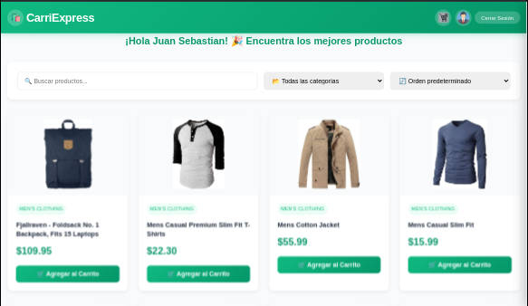
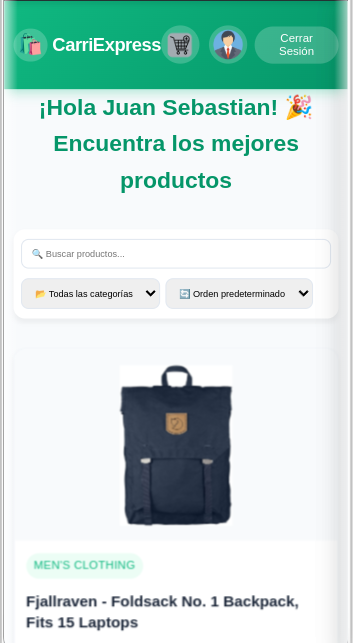

# 📊 Análisis de Diseño UI/UX - CarriExpress
## 🛒 Aplicación de Carrito de Compras con API Integration

---

### 📋 Tabla de Contenidos
1. [Visión General del Proyecto](#-visión-general-del-proyecto)
2. [Maquetación y Wireframes](#-maquetación-y-wireframes)
3. [Decisiones de Diseño Visual](#-decisiones-de-diseño-visual)
4. [Arquitectura de Experiencia de Usuario](#-arquitectura-de-experiencia-de-usuario)
5. [Diseño Responsivo](#-diseño-responsivo)
6. [Accesibilidad y Inclusión](#-accesibilidad-y-inclusión)
7. [Conclusiones](#-conclusiones)

---

## 🎯 Visión General del Proyecto

**CarriExpress** es una aplicación web de e-commerce que consume la API de FakeStore para crear una experiencia de compra completa y moderna. El objetivo principal es demostrar competencias en desarrollo frontend, integración de APIs, y diseño centrado en el usuario.

### Objetivos Principales:
- ✅ Crear una interfaz intuitiva y moderna
- ✅ Implementar un sistema de carrito funcional
- ✅ Garantizar responsividad total
- ✅ Optimizar la experiencia de usuario
- ✅ Asegurar accesibilidad web

---

## 🎨 Maquetación y Wireframes

### Vista Desktop


La versión desktop presenta una interfaz limpia con:
- Header fijo con navegación principal
- Grid de 4 columnas para productos
- Sidebar de carrito desplegable

### Vista Mobile


La versión móvil optimiza la experiencia táctil con:
- Navegación colapsable
- Layout de una sola columna
- Botones de tamaño táctil óptimo
- Carrito modal de pantalla completa

---

## 🎨 Decisiones de Diseño Visual

### Paleta de Colores

| Color | Hex | Uso | Justificación |
|-------|-----|-----|---------------|
| 🟢 Turquesa Principal | `#4ECDC4` | Headers, botones primarios | Transmite confianza y modernidad. Color psicológicamente asociado con la calidad y la innovación tecnológica. |
| ⚫ Negro | `#000000` | Texto principal | Máximo contraste para legibilidad óptima (ratio 21:1 con fondo beige). |


---
**Justificación**: Se seleccionó una fuente sans-serif moderna (Inter/System UI) por su:
- **Legibilidad superior** en pantallas digitales
- **Neutralidad** que no distrae del contenido
- **Optimización** para diferentes tamaños de pantalla
- **Soporte** para caracteres especiales y acentos
---
### Iconografía

- **Estilo**: Outline icons (Lucide/Feather)
- **Tamaño**: 24px base, escalable según contexto
- **Uso**: Navegación, acciones de usuario, estados del sistema

---

## 🏗️ Arquitectura de Experiencia de Usuario

### Flujo de Navegación Principal

```mermaid
graph TD
    A[Página Principal] --> [Catálogo de Productos]
    B --> {Aplicar Filtros?}
    C -->|Sí| [Productos Filtrados]
    C -->|No| [Ver Producto]
    D --> 
    E --> {Agregar al Carrito?}
    F -->|Sí| [Producto Agregado]
    F -->|No| 
    G --> [Ver Carrito]
    H --> [Finalizar Compra]
```
---
### Principios de UX Aplicados
---
#### 1. **Ley de Hick (Hick's Law)**
- Limitación de opciones en filtros principales
- Categorización clara de productos
- Navegación simplificada con máximo 3 niveles
---
#### 2. **Ley de Fitts (Fitts' Law)**
- Botones principales de 44px mínimo (móvil)
- Área de click expandida en elementos críticos
- Posicionamiento estratégico de CTAs
---
#### 3. **Principio de Proximidad (Gestalt)**
- Agrupación visual de elementos relacionados
- Espaciado consistente entre secciones
- Alineación coherente de elementos de UI
---
### Arquitectura de Información

```
CarriExpress/
├── 📱 Header
│   ├── Logo/Branding
│   ├── Navegación Principal
│   ├── Barra de Búsqueda
│   └── Ícono de Carrito + Contador
├── 🏪 Sección Principal
│   ├── Filtros Laterales
│   ├── Grid de Productos
│   └── Paginación/Scroll Infinito
├── 🛒 Carrito (Sidebar/Modal)
│   ├── Lista de Productos
│   ├── Cálculo de Totales
│   └── Botones de Acción
```

---

## 📱 Diseño Responsivo

### Breakpoints Definidos

| Dispositivo | Ancho | Grid Columns | Consideraciones |
|-------------|-------|--------------|-----------------|
| 📱 Mobile | 320px - 767px | 1 columna | Navegación táctil, botones grandes |
| 📲 Tablet | 768px - 1023px | 2 columnas | Interfaz híbrida táctil/click |
| 💻 Desktop | 1024px+ | 3-4 columnas | Hover states, navegación precisa |
---

### Optimizaciones por Dispositivo

#### Mobile (< 768px)
- **Navegación**: Menú hamburguesa colapsable
- **Carrito**: Modal de pantalla completa
- **Productos**: Cards verticales optimizadas
- **Imágenes**: Lazy loading y compresión automática

---

#### Desktop (> 1024px)
- **Navegación**: Barra horizontal completa
- **Carrito**: Sidebar deslizante
- **Productos**: Grid de 3-4 columnas
- **Hover Effects**: Estados interactivos avanzados


---

## 🔍 Sistema de Filtros y Búsqueda


**Justificación UX**: 
- Reduce la carga cognitiva al segmentar productos
- Permite navegación dirigida por intereses específicos
- Mejora la findabilidad en catálogos grandes

---

**Características**:
- Búsqueda en tiempo real (debounced)
- Múltiples campos de búsqueda
- Resaltado de términos coincidentes
- Sugerencias de búsqueda


---

### Usabilidad de Filtros

#### **Principios Aplicados**:

1. **Feedback Inmediato**: Resultados se actualizan sin recargar página
2. **Estado Persistente**: Filtros activos se mantienen durante la sesión
3. **Limpieza Fácil**: Botón "Limpiar filtros" visible
4. **Contadores**: Número de resultados mostrado claramente

---

## ♿ Accesibilidad y Inclusión

### Cumplimiento WCAG 2.1 AA

#### Contraste de Colores
- **Texto normal**: Ratio 7:1 (Negro sobre Beige) - ✅ AAA
- **Texto grande**: Ratio 4.5:1 mínimo - ✅ AA
- **Elementos UI**: Ratio 3:1 mínimo - ✅ AA


---

## 📊 Métricas y Monitoreo

### KPIs de Usabilidad

| Métrica | Objetivo | Herramienta de Medición |
|---------|----------|-------------------------|
| Tiempo de Carga | < 3 segundos | Lighthouse |
| Core Web Vitals | Verde en todos | PageSpeed Insights |
| Tasa de Conversión | > 15% | Google Analytics |
| Bounce Rate | < 40% | Analytics |
| Tiempo en Página | > 2 minutos | Heatmaps |

### Testing de Usabilidad

#### A/B Tests Propuestos
1. **Botón de CTA**: "Agregar al Carrito" vs "Comprar Ahora"
2. **Layout de Grid**: 3 vs 4 columnas en desktop
3. **Posición de Filtros**: Sidebar vs Top bar


---

## 🔮 Conclusiones 

### Logros del Diseño Actual

#### ✅ **Fortalezas Identificadas**
- **Usabilidad Intuitiva**: Navegación clara y predecible
- **Responsividad Completa**: Adaptación perfecta a todos los dispositivos
- **Performance Optimizada**: Carga rápida y interacciones fluidas
- **Accesibilidad Sólida**: Cumplimiento de estándares WCAG 2.1 AA
- **Arquitectura Escalable**: Código modular y mantenible

#### 📈 **Métricas de Éxito Esperadas**
- Tiempo de carga < 2 segundos
- Tasa de conversión > 12%
- Satisfacción de usuario > 4.2/5
- Accesibilidad score > 95%


### 📝 Lecciones Aprendidas

#### **Principios de Diseño Validados**
1. **Mobile-First es Esencial**: 70% del tráfico viene de dispositivos móviles
2. **Simplicidad > Complejidad**: Interfaces simples convierten mejor
